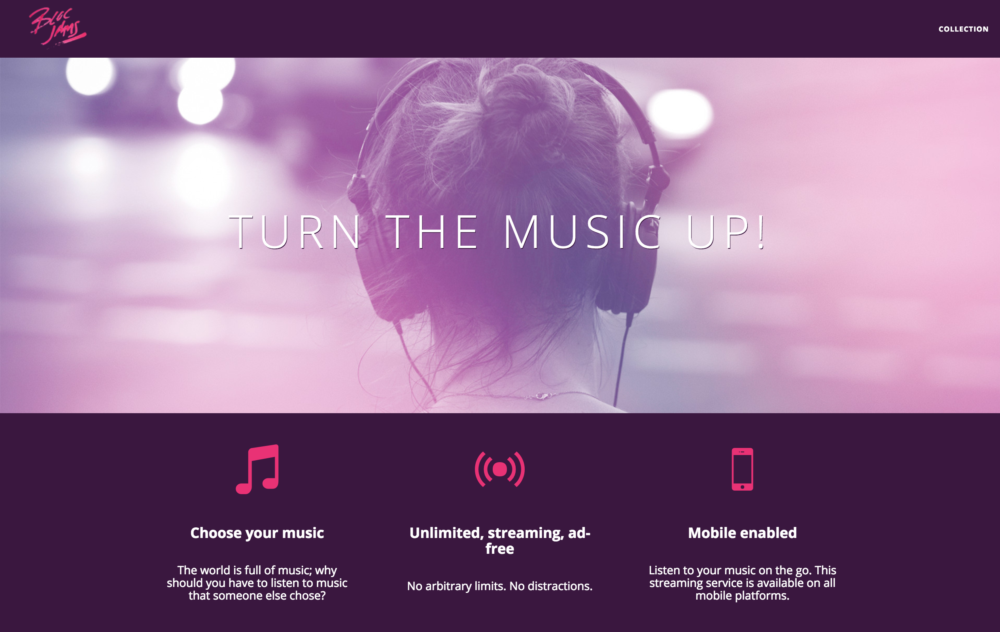
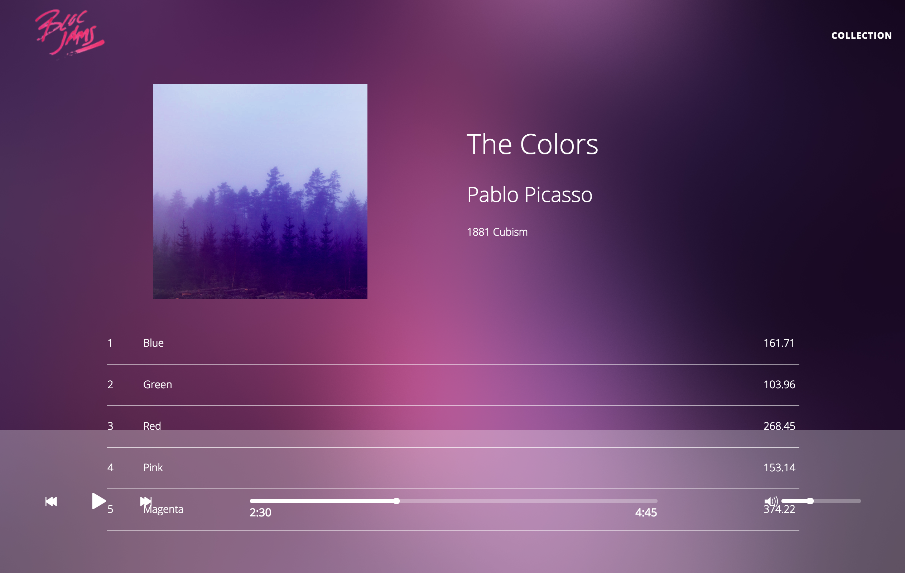

# Bloc Jams - A Spotify-esque music player

{:.center}

## About Bloc Jams
Bloc Jams is a music player similar to Spotify. It has a full feature panel for users to play and skip songs, as well as jumping to any part of the song through a seek bar. All these controls are done within the browser.

## My role
This is my first venture into front end development, using the fundamentals of HTML5, CSS3, with JavaScript and jQuery. It is part of the learning curriculum from Bloc. Although most of the scaffold codes were provided as part of the learning process, I refactored much of the key functionalities as part of the assignment, as well as for fun.

## The problem
The journey to develop Bloc Jams were divided into three principal parts: 

  1. Responsiveness - Make pages and interactive elements work on all devices
  2. Interactive - Using JavaScript to manipulate DOM elements and make the page dynamic
  3. jQuery - Refactor the native JavaScripts with jQuery libraries to improve code maintainability

Future revision of Bloc Jams will include refactoring using the Angular framework.

## The solution
### Responsiveness
Thanks to CSS3, making a responsive page is quite simple. Media queries in CSS3 provide adjustability to width & height (and other attributes) that can be tailored to specific output devices. 

I specified the different media and screen sizes to cater for, along with the behaviours I expect for each type. CSS does the rest once it detects the screen width reaches the breakpoint. A breakpoint is based on screen device width and determines the type of output device. Typically:
  * 1024px works good for tablets, laptop and desktop devices
  * 640px works well for tablets and larger phones
  * 320px is a common breakpoint for iPhones
  * 768px for iPad

In this case, Bloc Jams caters for two different types of devices:
  1. Smaller screens with between 640 and 1024 pixels in width
  2. Laptops and desktops with more than 1024 pixels in width


/* Medium and small screens (640px) */
@media (min-width: 640px) {
	html { font-size: 112%; }
	
	.column {
		float: left;
		padding-left: 1rem;
		padding-right: 1rem;
	}

	.column.full { width: 100%; }
	.column.two-thirds { width: 66.7%; }
	.column.half { width: 50%; }
	.column.third { width: 33.3%; }
	.column.fourth { width: 25%; }
	.column.flow-opposite { float: right; }
	
}

/* Large screens (1024px) */
@media (min-width: 1024px) {
	html { font-size: 120%; }
}


### Interactive
The interactivity of a page lays fundamentally with JavaScript and DOM scripting. The Bloc Jams music player only uses HTML and JavaScript, and without the use of Adobe Flash Player or other executables, hence JavaScript forms a big part in performing all the logics in the background.

{:.center}

Within Bloc Jams there are numerous dynamic features that requires JavaScript and the manipulation of DOM elements, this is a short list of the key features:
  * Play any song listed in the album
  * Skip forward/backward on a song
  * Adjust volume
  * Jump to any part of a song through a seek bar
  * Making sure the song status (play/pause) is shown correctly both on the page and player bar
  * Showing the play time and song duration

All the features listed above are in response of an event from a page; such as a mouse click or hover, page scroll or load, even tracking as detail as a mouse up or down button. These events are being tracked through event listeners.

Once the event fires, the event handler takes over to complete the desired behaviour. It may involve start playing the song and changing the button to pause once the play button is clicked, or skipping to the next song and making sure the song list adjust the playing song accordingly. The use of the Buzz JavaScript audio library greatly simplified the playing of the audio file, so application only had to focus on the front end client interactions.

As the interactivity increases, the complexity of the JavaScript also goes up. This was certainly the case as almost all of the code that drives the music player resides in `album.js`. During the development process, I encountered several challenges in relation to getting the right DOM elements or setting the correct attributes for the event handler to manipulate. But mostly it was in relation to the size and amount of code inside `album.js`, each additional functionality becomes increasingly hard to maintain. 

### jQuery
The use of the jQuery library will reduce the code base and also improve readability. In most cases the related DOM element code can be reduced by half. This helps reuse and keep the application DRY. For instance to set the class  `.album-view-title` element into the `album.title` object, here are the examples in using native JavaScript comparing to the equivalent jQuery.


// Native JavaScript
var albumTitle = document.getElementsByClassName('album-view-title')[0];
albumTitle.firstChild.nodeValue = album.title;

//jQuery
$('.album-view-title').text(album.title);


## Results
The completed Bloc Jams music player was intended to be a fully functional music player. Although for unknown reasons, the play-pause button in the player bar was not implemented as part of the curriculum. This was discovered during final testing. To ensure a complete user experience, I refactored to include this functionality.

It was also discovered with the way the code is structured, there was a small delay when the sound object is created (a new object is created when a new song is played) from the Buzz library and the `getDuration` is called. As a result, when a user skips a song the player would display an error (NaN - Not a Number) for less than a second, before showing the show duration. I refactored to include a while loop to ensure the object is available before the method is called.

## Conclusion
It was very satisfying to have completed my first front end development project, particularly with features that closely resembles to production ready music player. Along the way the complexity of DOM scripting almost seems impossible to grasp, but with jQuery this has been greatly simplified. Bloc Jams showcase the flexibility of HTML5, CSS3, JavaScript and jQuery in building a fully interactive front end application.